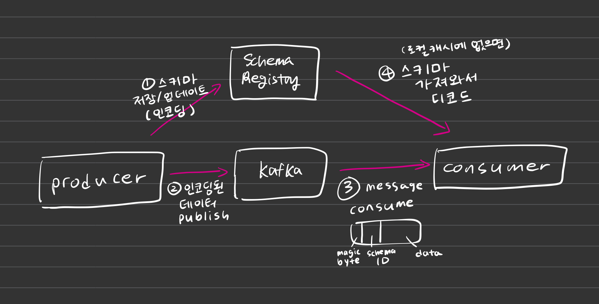
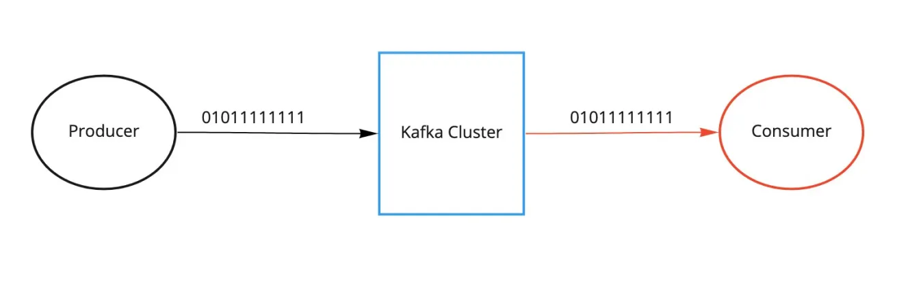

Kafka Schema Registry
=====================


- zookeeper, kafka broker, schema-registry, ui
  - docker containers
- producer, consuer app
  - ruby
  - springboot

#### Schema Registry가 무엇인가?

schema registry 없이 사용


schema registry => 메세지 스키마가 올바른지 검증 가능


여러가지 구현체가 있으나 그 중 confluent사에서 만든 **confluent schema registry**가 가장 많이 쓰임.  
여기서 채택한 데이터 포맷이 **AVRO** (다른 포맷도 지원하긴 하는 듯?)
- Avro (default)
- ProtoBuf
- JSON

#### Compatibility Type
스키마 변경할 일 있을 때

- BACKWARD : Consumer를 먼저 upgrade 해야함
- FORWARD : Producer를 먼저 upgrade 해야함
- FULL : 순서 상관 x

[문서](https://docs.confluent.io/platform/current/schema-registry/fundamentals/schema-evolution.html#summary)

#### Subject Name Strategy
순서를 보장 받아야 하는 메세지는 같은 토픽에 produce 해야함.  
따라서 하나의 토픽의 여러가지 스키마의 메세지가 들어올 수 있음.  
이 때 subject (=schema registry에서 스키마 버전 관리까지 고려한 논리적 단위.) 네이밍 전략을 어떻게 해야할까?

- TopicNameStrategy (default setting) : 한 토픽에 한가지 스키마만 등록가능.
- RecordNameStrategy
- TopicRecordNameStrategy


### INFO
```
kafka
localhost:9094

schema-registry
localhost:8081

ui
localhost:9090
```

### Run Locally
```bash
docker-compose up -d
```
[kafka 대시보드](localhost:9090)

java-app
1. src/main/avro/*.avsc 파일 작성
  
2. *.avsc 파일을 토대로 대응되는 Java 클래스 파일 생성하기  
(build/generated-main-avro-java 디렉토리에 생성됨)
```
./gradlew generateAvroJava
```
3. app 실행   
```
producer로 실행 : @kafkaListener 코드 주석 처리하고 돌리기  
consumer로 실행 : producer.sendMessage 코드 주석 처리하고 돌리기
```


