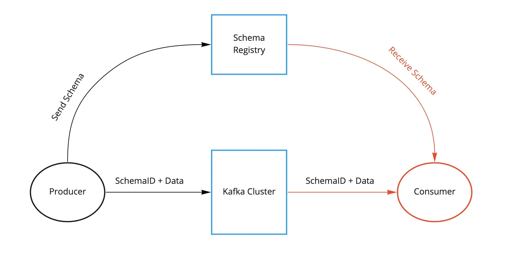

Kafka Schema Registry
=====================

schema registry 없이 사용


schema registry => 메세지 스키마가 올바른지 검증 가능


여러가지 구현체가 있으나 그 중 confluent 사에서 만든 confluent schema registry가 가장 많이 쓰임.
여기서 채택한 데이터 포맷이 AVRO

### INFO
```
kafka
localhost:9094

schema-registry
localhost:8081

ui
localhost:9090
```

### run locally
```bash
docker-compose up -d
```


